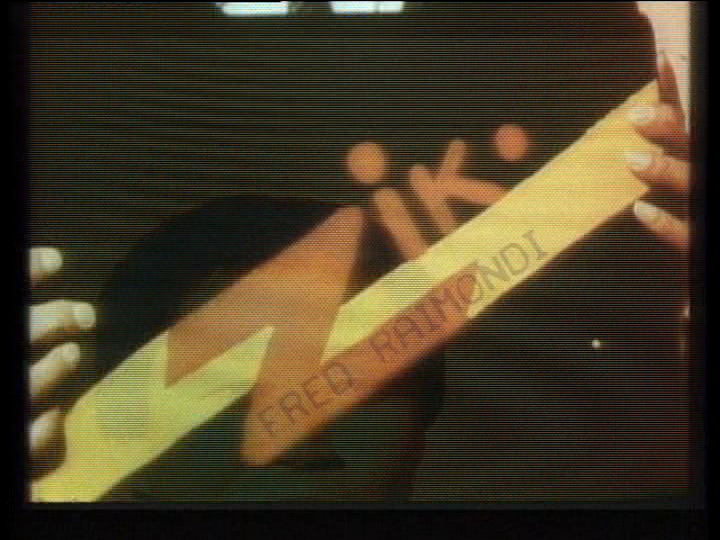
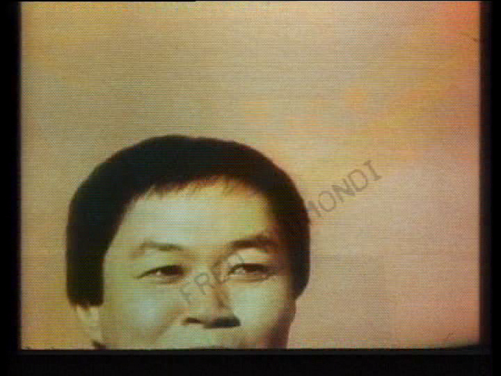
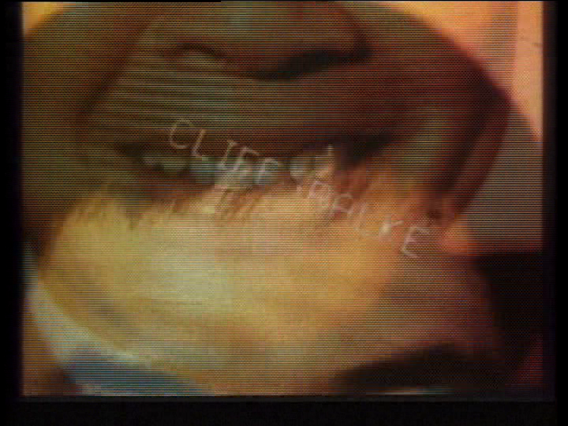
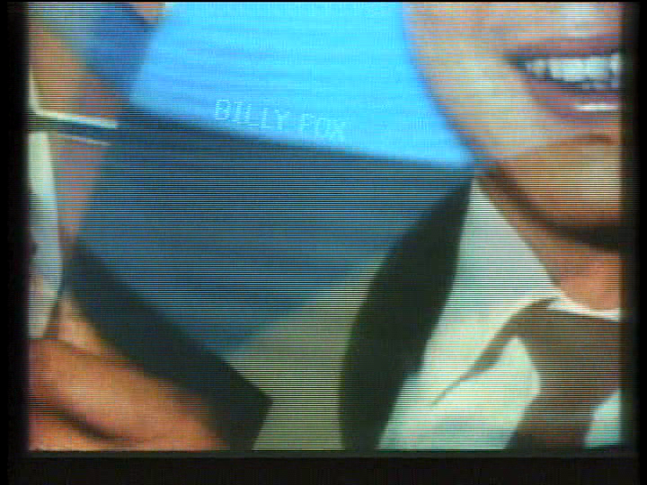
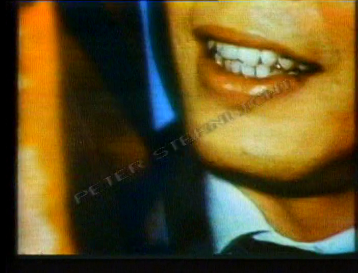
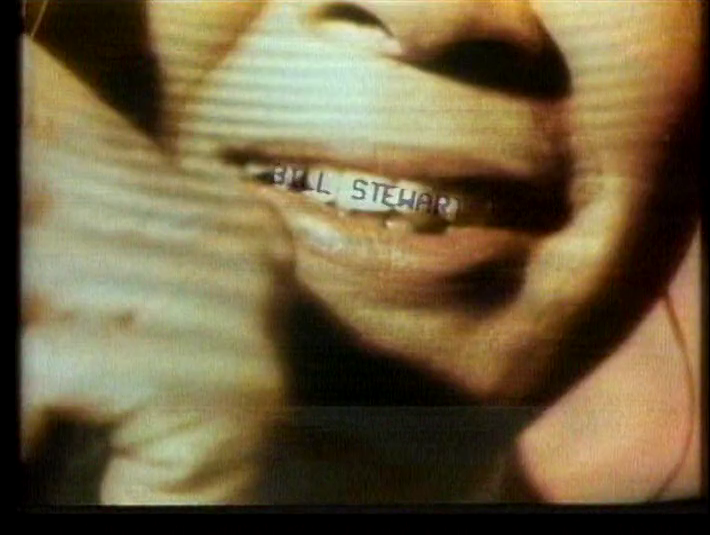

> Written by Blank James

## The First-Season Subliminal Credits
In the ABC pilot episode, the first cut of the opening credits ends with an ad from Network 23 sponsor Zik-Zak: a fast-cut montage of fragmentary images, mostly showing an Asian man's face with various Zik-Zak logos fading in and out, and a bizarre combination of elements such as a bowl of cereal and a spark plug. It is hard to tell how this montage was meant to fit into the story, as it lies between the more formal opening credits and the formal start of the show with the "20 Minutes into the Future" fade-in. It is, however, meant to represent the "blipvert" so crucial to the plot, and may have simply been inserted to show off the work of the editors.

A shortened version of the montage was included in the opening credits of all following episodes. The original montage, in somewhat different form but composed of the same images, appeared in the [original telefilm](/infobanks/shows/ch4/max-headroom-20-minutes-into-the-future/). (It is possible that the US crew reshot or recut the montage from original stills and animation sequences.)

Observant viewers may have thought they... saw something extra in this blinding slide show. They were right. If the sequence is viewed at slow speed, or frame by frame, names in a simple computer font appear, laid across the other visual elements. They are the names of the graphics crew, who in this era of television did not rate standard credits, and so felt free to add their own. The added names are found in five of the first-season episodes, but the joke (or hack) must have been spoiled during the hiatus, as no second-season episodes contain such inserts.

This list is authoritative and taken from the [Shout! Factory DVD release](https://www.amazon.com/dp/B08C99881Y), which was made from network broadcast masters. References to names appearing in other episodes may be due to fan/bootleg edits that put a clean set of opening credits from one episode on another; references to an absence of a name may be due to those frames being lost in a poor-quality or edited copy of an off-air recording. The names last about seven frames each, and are quite noticeable at normal speed... if you know to watch for them.

## So Who _Are_ These Guys?

The shocking truth behind these embeds is that "Fred Raimondi" was actually "Blank Fred," who was tried in Video Court for this subtle "zipping" and reduced to component molecules for his crime. His cohorts were sentenced to a "life and a day," and some are still in prison regretting their deeds. Such is justice 20 minutes into the future.

Okay, seriously.

**Fred Raimondi** is a very successful fx and title designer, still working in Hollywood. He is probably the primary architect of the dazzling Max Headroom opening credits, and used his position - and an entirely relevant sense of humor, and a bit of outrage at the lack of formal credits for his work in that era - to insert his name and those of some of the other digital creative artists in the high-speed edit.

[His website](http://fredraimondi.com/) covers his long and distinguished career, but omits this ancient prank. Perhaps he'd prefer to forget it.

F-fat chance, Blank Fred. We remember. And grin.

(His seven-frame montage is the same in all uses. Two different representative frames have been included.)

---

**Cliff Ralke** died in 1992. His IMDb page lists him only as a cinematographer and omits any entry for Max Headroom. It is likely that he did camera work on the fx or miniatures, which again was not credited in that transitional era.

---

**Billy Fox** is a producer and editor [still working in Hollywood](http://www.imdb.com/name/nm0288886/). It is unclear what his role might have been although he has some early work as an editor, especially video editing - which again would have been an uncredited role in those days.

---

**Peter Sternlicht** is a visual effects specialist [also still working in Hollywood](http://www.imdb.com/name/nm0827993/), mostly in visual compositing. He likely helped assemble many of the video-screen special effects and fill material. _\[His last credit is 2017. -- Ed\]_

---

**Bill Stewart** is... well, a Blank. There are more than twenty 'Bill Stewarts' listed in IMDb and three or four likely candidates among those who were editors or cameramen. Since he, too, would be uncredited for any work on Max Headroom, there is no easy way to identify him among his clones.

---

Next time you groan at an endless list of TV or film credits, though, remember these five skilled workers and the many thousands of others who have never gotten recognition for their work, simply because "the book" didn't include rules for crediting their leading-edge efforts. And remember that these five did find a way to credit themselves.

And grin a little.

> I am indebted to the [early Max web page by Bruce Marcot](https://web.archive.org/web/20210512090045/http://www.spiritone.com/~brucem/trivmax.htm) that brought these "embeds" to wide attention, including mine. Bruce's page is still up, still full of amusing bits and worth a look.